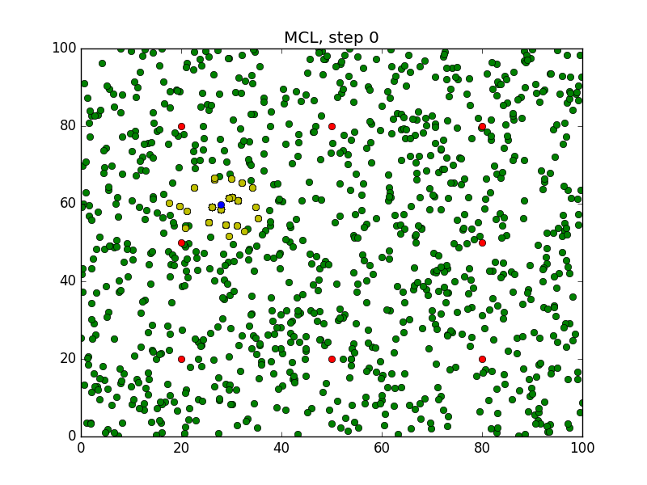
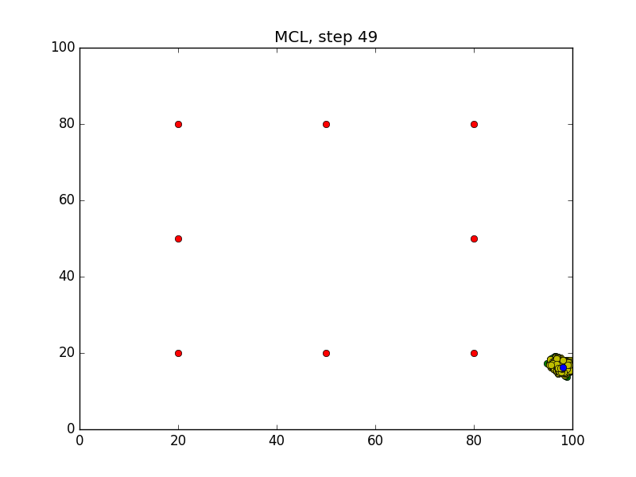

# MCL_algorithm

The Monte Carlo Localization (MCL), or "particle filter localization", algorithm is used to estimate the position and orientation of a robot. Given a map of the environment, the algorithm estimates the position and orientation of a robot as it moves and senses the environment. The algorithm uses a particle filter to represent the distribution of likely states, with each particle representing a possible state (i.e. a hypothesis of where the robot is). 

The algorithm starts with a uniform random distribution of particles over the configuration space, meaning the robot has no information about where it is and assumes it is equally likely to be at any point in space. Whenever the robot moves, it shifts the particles to predict its new state after the movement. Whenever the robot senses something, the particles are resampled based on recursive Bayesian estimation (i.e. how well the actual sensed data correlate with the predicted state). Ultimately, the particles should converge towards the actual position of the robot.

### Compiling the Program

Clone the driver:
```
$ cd /home/workspace/
$ git clone https://github.com/barrymulvey/MCL_algorithm
$ cd MCL_algorithm/
```
Empty the Images folder:
```
$ rm -rf Images/*
```
Compile the program:
```
$ g++ main.cpp -o app -std=c++11 -I/usr/include/python2.7 -lpython2.7
```

### Running the Program
Before running the program, ensure the `Images` folder is empty (step covered above). 
```sh
$ ./app
```
Wait for the program to iterate `50` times.

### Generated Images
After running the program, `50` images will be generated in the `Images` folder.
#### Step0

#### Step49


